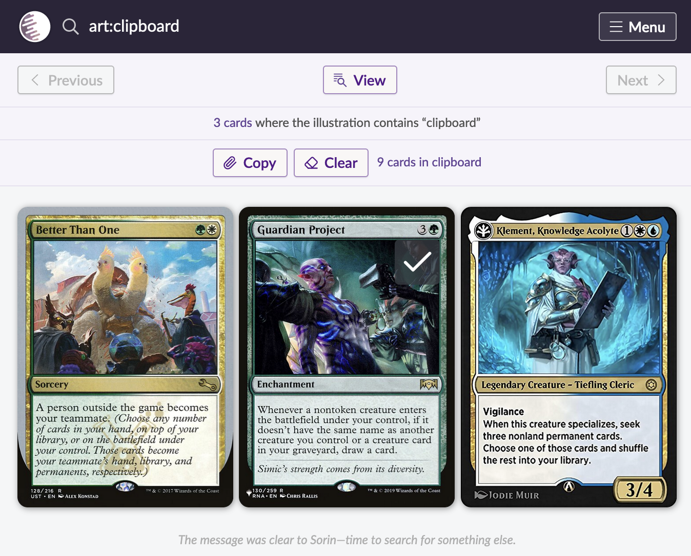

# Scryfall Clipboard - Firefox Browser Extension

*Add an EDHREC-like clipboard for copying card names on Scryfall*

## Download

Download the extension [here](https://addons.mozilla.org/en-CA/firefox/addon/scryfall-search-clipboard/).

## Goal

Scryfall Clipboard is meant to be a very simple extension that makes it easier to build decks using searches on [scryfall](https://scryfall.com). It is not meant to provide an extensive clipboard editing experience, only provide the bare minimum needed.

## Features

* Simplistic and on-theme
* Support touch and non-touch screens
* Shows number of cards in clipboard
* Shows if a card is in the clipboard or not with a button
* Mostly keeps the copy button out of the way
  * In the art of sagas and regular cards
  * About in between the mana cost and name for battles (this is purely accidental)
* Use local storage to store clipboard
* Allows copying and clearing the clipboard

## Non-Features

* Clipboard management
  * Seeing a visual card list
  * Removing items of said card list
* Export the clipboard other than plain text copying
* Copy specific card printings
* Show the clipboard price
* Show the clip board buttons on pages other than the search page (e.g. the individual card page)